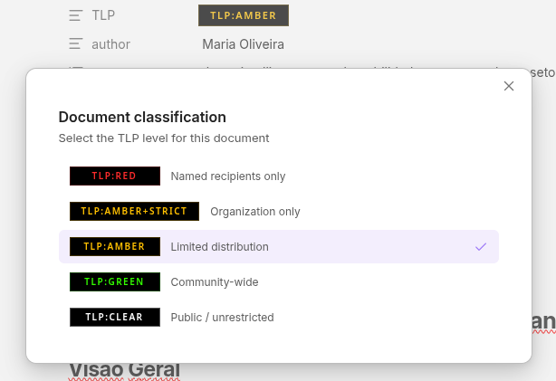
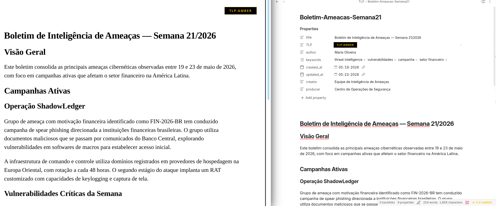
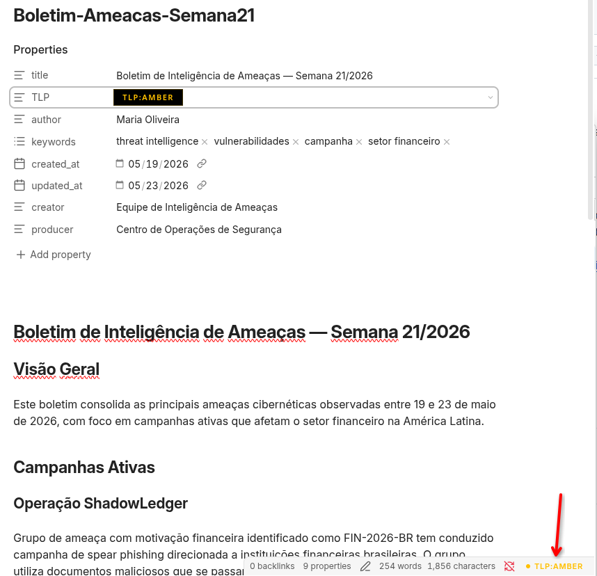

# TLP Classification

Classify your Obsidian documents using the [Traffic Light Protocol (TLP)](https://www.first.org/tlp/) standard. Select the classification level from a visual picker, and automatically generate PDF header badges when exporting with [Better Export PDF](https://github.com/l1xnan/obsidian-better-export-pdf).



## Features

- **Visual TLP selector** — A dropdown widget replaces the native text input in the Properties panel. Click the badge to pick a classification level with colored indicators and descriptions.
- **Command palette** — `Set TLP classification` opens a keyboard-navigable modal (`Ctrl/Cmd + P`). Arrow keys to move, Enter to select.
- **Status bar indicator** — Displays the current document's TLP level at the bottom of the editor. Click to change it.
- **Automatic PDF badges** — Generates the `headerTemplate` or `footerTemplate` frontmatter property for Better Export PDF. The badge follows the official TLP color specification with black background and colored text.
- **Sync on manual edit** — If you change the `TLP` property directly in the frontmatter or source view, the template regenerates automatically.
- **Custom levels** — Define organization-specific classification levels in a markdown file within your vault.
- **Official TLP 2.0 colors** — Built-in levels follow the [FIRST.org specification](https://www.first.org/tlp/): `TLP:RED`, `TLP:AMBER+STRICT`, `TLP:AMBER`, `TLP:GREEN`, `TLP:CLEAR`.





## Installation

### From community plugins

1. Open **Settings → Community plugins → Browse**
2. Search for **TLP Classification**
3. Click **Install**, then **Enable**

### Manual installation

1. Download `main.js`, `manifest.json`, and `styles.css` from the [latest release](https://github.com/YOUR_USERNAME/obsidian-tlp-classification/releases/latest)
2. Create `.obsidian/plugins/tlp-classification/` in your vault
3. Copy the three files into that folder
4. Enable the plugin in **Settings → Community plugins**

## Usage

### Setting a classification

Open a document and use any of the following:

- **Properties panel** — Click the TLP badge in the properties to open the visual selector
- **Command palette** — `Ctrl/Cmd + P` → *Set TLP classification*
- **Status bar** — Click the TLP indicator at the bottom-right of the editor

The plugin writes the `TLP` value and the corresponding `headerTemplate` to the frontmatter. The template property is hidden from the Properties panel to keep it clean.

### Exporting to PDF

Export your document using Better Export PDF as usual. The TLP badge will appear on every page of the exported PDF, following the official color specification.

### Changing or removing the classification

Run the selector again to change the level — the frontmatter updates in place. To remove the classification entirely, use `Ctrl/Cmd + P` → *Remove TLP classification*.

## Settings

| Setting | Default | Description |
|---|---|---|
| Badge position | Right | Left, center, or right alignment in the PDF header/footer |
| Template target | Header | Write the badge to `headerTemplate` or `footerTemplate` |
| Show page number | Off | Include page numbers alongside the badge in the PDF |
| Status bar indicator | On | Show/hide the TLP display in the status bar |
| Editor banner | On | Show a colored stripe at the top of the editor |
| Require classification | Off | Warn on export if no TLP is set |
| Frontmatter property | `TLP` | The property name used in the frontmatter |
| Custom levels file | *(empty)* | Path to a markdown file defining custom levels |

## Custom classification levels

To define custom levels, create a markdown file in your vault (e.g. `_config/tlp-levels.md`) with the following frontmatter:

```yaml
---
levels:
  - value: RED
    label: "TLP:RED"
    fontColor: "#FF2B2B"
    bgColor: "#000000"
    description: "Named recipients only"
  - value: INTERNAL
    label: "INTERNAL"
    fontColor: "#7B68EE"
    bgColor: "#000000"
    description: "Internal use only"
---
```

Then set the file path in **Settings → TLP Classification → Custom levels file**.

See [`example-tlp-levels.md`](example-tlp-levels.md) for a complete reference with all fields documented.

## Recommended plugins

This plugin works standalone for document classification. For TLP badges in exported PDFs, install [Better Export PDF](https://github.com/l1xnan/obsidian-better-export-pdf).

## TLP color reference

| Level | Font | Background | Hex font | Hex background |
|---|---|---|---|---|
| TLP:RED | Red | Black | `#FF2B2B` | `#000000` |
| TLP:AMBER+STRICT | Amber | Black | `#FFC000` | `#000000` |
| TLP:AMBER | Amber | Black | `#FFC000` | `#000000` |
| TLP:GREEN | Green | Black | `#33FF00` | `#000000` |
| TLP:CLEAR | White | Black | `#FFFFFF` | `#000000` |

Colors follow the [FIRST.org TLP 2.0 specification](https://www.first.org/tlp/).

## Building from source

```bash
git clone https://github.com/YOUR_USERNAME/obsidian-tlp-classification.git
cd obsidian-tlp-classification
npm install
npm run build
```

Copy `main.js`, `manifest.json`, and `styles.css` to `.obsidian/plugins/tlp-classification/` in your vault.

## Contributing

Contributions are welcome. Please open an issue first to discuss what you'd like to change.

## License

[MIT](LICENSE)
